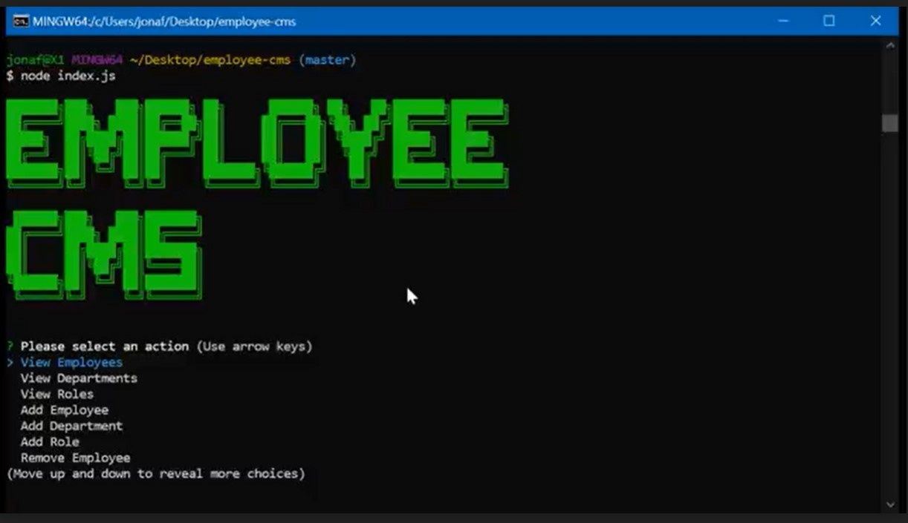

# Employee CMS

## Description 

MySQL and Node based employee management system

## Table of Contents

* [Installation](#installation)
* [Usage](#usage)
* [License](#license)
* [Additional-Badges](#additional-badges)

## Installation

Clone the repository with the following command:

    git clone git@github.com:jonafi/employee-cms.git

Install all the dependencies with the following command:

    npm i

## Usage 

Navigate to the employee-cms folder and enter the following command:

    node index.js

The menu displays the available CMS functions.  Seed starter data can be found in the employee-tracker.sql file

### Demo Video

## License

## Additional-Badges

---
© 2020 Jonafi
